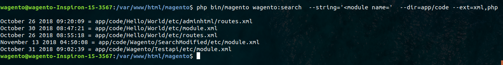
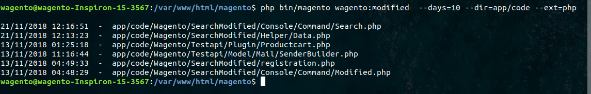

# module-searchmodified
This Module is use to search string and find modified files.

## Version
We are adding a new version management to make module installation available through composer, so this is the table for reference: 

Magento Version | Composer prefix 
----            | ---- 
2.x.x           | 100.x.x

## ✓ Install via composer (recommend)
Run the following command in Magento 2 root folder:

```
composer require ashish-wagento/module-searchmodified::100.0.1
php bin/magento setup:upgrade
php bin/magento setup:static-content:deploy
```

### Search Content

It is very easy to search content, search content in specific directory. 

| Parameter  | Value  | Required? |
| :------------ |:---------------| :-----|
| --string | Enter string to search e.g. AccountController | Yes
| --dir  | Directory path e.g. app/code/ | No
| --ext  | File extensions, Enter file extensions. e.g. php / For multiple file types e.g. php,phtml | No

Run the following command in Magento 2 root folder:

```
php bin/magento wagento:search  --string='<module name='  --dir=app/code --ext=xml,php
```

**Output**


### Search Modified Files

This feature is useful to search the modified files within the folder.

| Parameter  | Value  | Required? |
| :------------ |:---------------| :-----|
| --days | Number Of Days | Yes
| --dir  | Directory path e.g. app/code/ | No
| --ext  | File extensions, Enter file extensions. e.g. php / For multiple file types e.g. php,phtml | No

Run the following command in Magento 2 root folder:

```
 php bin/magento wagento:modified  --days=10 --dir=app/code --ext=php
```

**Output**


> Note: To search today's modified files you can set parameter like --days=0
